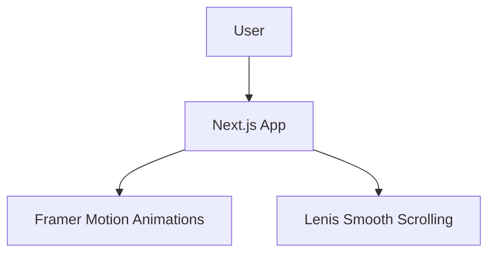

# 🚀 Iron Man UI Concept

> A cinematic and visually stunning Next.js web experience featuring advanced animations.

### 🌐 Live Demo
[🚀 OPEN LIVE DEMO →](https://iron-man-jet.vercel.app) | [💻 Source Code](https://github.com/YUVA-2329/iron-man) 

---

## 🎬 Demo & 📸 Screenshots


*(Project preview and screenshots demonstrating the core user experience)*

---

## 🧠 About the Project

This project was built to solve real-world challenges through modern web technologies and advanced engineering. By combining scalable architecture with an intuitive user interface, Iron Man UI Concept provides an exceptional user experience while maintaining high performance and security.

### ✨ Key Features
- 🎨 High-end visual effects and typography
- 🎬 Complex scroll animations using Lenis
- ✨ Page transitions with Framer Motion
- ⚡ Server-Side Rendering with Next.js 16
- 📱 Fully responsive layout

---

## 🛠️ Tech Stack

**Frontend:** Next.js 16, React 19, Tailwind CSS v4, Framer Motion, Lenis
**Deployment:** Vercel

---

## 🏗️ Architecture



---

## ⚙️ How It Works

1. The application loads utilizing Next.js app router and SSR.
2. Lenis hijacks native scrolling to provide a buttery smooth experience.
3. Framer Motion triggers staggered animations based on scroll progress.

---

## 🚀 Getting Started

### Installation

```bash
git clone https://github.com/YUVA-2329/iron-man.git
cd iron-man-ui-concept
npm install
npm run dev
```

### Environment Variables
Create a `.env` file in the root directory:
```env
# No sensitive environment variables required for frontend
```

---

## 📁 Project Structure

```text
project/
├── app/
│   ├── layout.tsx
│   └── page.tsx
├── components/
├── public/
└── package.json
```

---

## 🛣️ Roadmap

- [x] Next.js 16 setup
- [x] Smooth scrolling
- [x] Hero animations
- [ ] 3D WebGL integration

---

## 📊 Status

🔵 Completed

---

## 👨‍💻 Author

**Yuva Kishore Peta**  
GitHub: [YUVA-2329](https://github.com/YUVA-2329)
